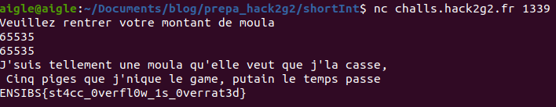

# Challenge 26/08/2020
Ce write-up concerne le challenge du 05/08/2020 obtenu à l'adresse : [https://twitter.com/CTF_Inter_IUT/status/1298636392289964032](https://twitter.com/CTF_Inter_IUT/status/1298636392289964032)


## Ce qu'on a
Pour ce challenge, on nous donne le code source du service qui tourne, ainsi que l'addresse:port auquel le joindre.
## Analyse du code source
```
#include <stdio.h>
#include <stdlib.h>
#include <stdbool.h>

void get_the_moula() {
	FILE *file_pointer = fopen("flag", "r");  

	fseek(file_pointer, 0, SEEK_END);  
	long file_size = ftell(file_pointer);  
	unsigned char *file_content = malloc(file_size);  
	rewind(file_pointer);
	fread(file_content, 1, file_size, file_pointer);  
	fclose(file_pointer);  
	int i = 0;
	while (i < file_size) {
		printf("%c",file_content[i]);
		i++;
	}
}

bool check(short moulant) {
	return moulant <= 0;
}

int main(int argc, char **argv) {
	int start = 1000;
	int user_input;

	do {
		puts("Veuillez rentrer votre montant de moula");
		scanf("%d", &user_input);
	} while (user_input <= 0);

	if (check(user_input)) {
		puts("J'suis tellement une moula qu'elle veut que j'la casse,\n Cinq piges que j'nique le game, putain le temps passe");
		get_the_moula();
	} else {
		puts("Vous disposez de trop de moula, vous n'en méritez pas plus");
	}
	return 0;
}
```
Rapidement, on comprend que get_the_moula est la fonction d'affichage du flag, check une fonction qui retourne vrai si le short moulant est plus petit ou égal à 0 et main la fonction principale.
Main demande un entier à l'utilisateur. Celui-ci doit être strictement supérieur à 0.
Après cela, si check retourne vrai, on obtient le flag.
## La faille
Le soucis de ce problème réside dans le typage : on demande un entier à l'utilisateur (codé sur 4 octets, et signé) et la fonction check prend un short (codé sur 2 octets et signé). Le programme va donc uniquement regarder les 2 octets de poids faible et vérifier s'ils correspondent à un nombre négatif. L'astuce va donc être de passer un entier positif, dont les 2 octets de poids faible correspondent à un short négatif. On va faire la conversion de -1 à la main, si vous ne savez pas comment passer d'un décimal à un binaire signé, vous pourrez comprendre [ici](http://www.courstechinfo.be/MathInfo/NbrSignes.html):
```
1 = 0b00000000 00000001
INVERSION :
  = 0b11111111 11111110
PLUS UN :
  = 0b11111111 11111111
CE QUI DONNE EN NON SIGNE : 
0b11111111 11111111 = 65535
```
On va donc passer 65535 au programme.
## Le flag ! Le flag !

##### Auteur : aiglematth
